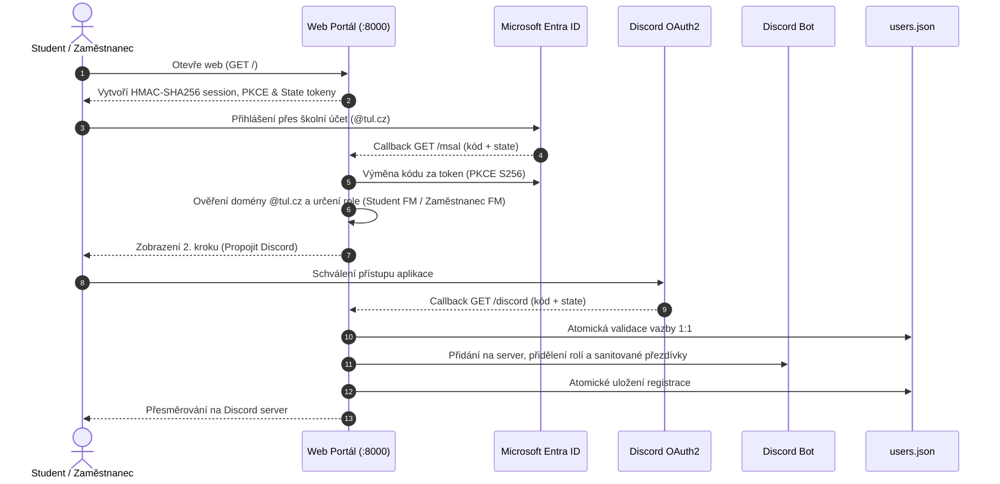

# FM TUL - Discord Connector

[](https://go.dev/)
[](https://github.com/Mapetr/discord-pslib-connector)
[](https://github.com/Mapetr/discord-pslib-connector)
[](https://opensource.org/licenses/MIT)
[](https://github.com/Mapetr/discord-pslib-connector)
<!-- AUTO_METRICS_START -->
[](https://go.dev/)
[](https://go.dev/)
[](https://go.dev/)
[](https://discord.com/)
<!-- AUTO_METRICS_END -->

> **Oficiální integrační platforma pro propojení univerzitních identit Microsoft Entra ID (TUL) s komunitním serverem na síti Discord.**  
> Optimalizováno pro Fakultu mechatroniky, informatiky a mezioborových studií Technické univerzity v Liberci (FM TUL).

---

## Obsah

1. [Přehled projektu](#přehled-projektu)
2. [Architektura a toky dat](#architektura-a-toky-dat)
3. [Klíčové funkce](#klíčové-funkce)
4. [Bezpečnostní model (Defense-in-Depth)](#bezpečnostní-model-defense-in-depth)
5. [Instalace a rychlý start](#instalace-a-rychlý-start)
6. [Konfigurace prostředí](#konfigurace-prostředí)
7. [Katalog Slash Příkazů](#katalog-slash-příkazů)
8. [Produkční nasazení (systemd & Nginx)](#produkční-nasazení-systemd--nginx)
9. [Testování a vývoj](#testování-a-vývoj)
10. [Vývoj s využitím AI a Knowledge Base](#vývoj-s-využitím-ai-a-knowledge-base)
11. [Licence](#licence)

---

## Přehled projektu

FM TUL Discord Connector řeší bezpečné a plně automatizované ověřování členů akademické obce (studentů a zaměstnanců) při vstupu na fakultní Discord server.

### Hlavní přínosy:
- **Autentizace přes školní Microsoft Entra ID:** Uživatel se autorizuje výhradně svým univerzitním účtem (`@tul.cz` nebo `@fm.tul.cz`).
- **Nulová databázová závislost:** Aplikace nevyžaduje žádný SQL server (PostgreSQL, MySQL) ani Redis. Vše běží v jediné zkompilované binárce v jazyce Go s atomickým ukládáním do lokálních zabezpečených souborů (`0600`).
- **Striktní 1:1 vazba (Anti-Multi-Accounting):** Jeden univerzitní e-mail nelze provázat s více Discord účty a naopak.
- **Plná administrace přes Discord:** Role, uvítací kanály, auditní kanál a uvítací zprávy lze spravovat přímo v Discordu přes slash příkaz `/config` bez nutnosti sahat do konfigurace na serveru.

---

## Architektura a toky dat



---

## Klíčové funkce

- **Automatické přidělování rolí:** Rozpoznání role (`Student FM`, `Zaměstnanec FM`, `Ověřený`) na základě Microsoft profilu a automatické udělení na Discordu.
- **Sanitizace přezdívek:** Automatické nastavení přezdívky podle jména v MS Graph API s filtrací řídicích znaků, neviditelných mezer (zero-width characters) a zneužitelných tagů (`@everyone`, `@here`, `<@`).
- **Auditní systém v reálném čase:** Barevné embed zprávy odesílané do dedikovaného Discord kanálu zaznamenávající přihlášení, bezpečnostní události (CSRF, multi-accounting, rate limity) a akce na serveru (smazání zpráv, odchody členů).
- **RSS Modul pro fakultní novinky:** Asynchronní stahování a embedování článků z webů TUL s ochranou proti SSRF útokům.
- **Uvítací zprávy (Welcome Embeds):** Automatické uvítání nově příchozích členů s interaktivním tlačítkem pro přechod k ověření.
- **Mock režim pro lokální vývoj:** Možnost simulovat Microsoft i Discord přihlášení bez přístupu k produkčním API (`ENABLE_DEV_MOCK=true`).

---

## Bezpečnostní model (Defense-in-Depth)

Projekt je od základu navržen podle přísných bezpečnostních standardů:

| Bezpečnostní vrstva | Použitá technologie / princip | Ochrana proti |
| :--- | :--- | :--- |
| **Relace & Cookies** | `HMAC-SHA256` podepisování, `HttpOnly`, `SameSite=Lax`, `Secure`, `COOKIE_DOMAIN` | Session Hijacking, krádež cookies skrze XSS, podvržení session |
| **OAuth2 CSRF** | 256-bitové kryptografické State tokeny spotřebovávané atomicky v konstantním čase | CSRF útoky na autorizační callbacky, replay útoky |
| **Krádež kódu** | PKCE (RFC 7636) s metodou `S256` | Authorization Code Interception na síťové vrstvě |
| **Síťový DoS** | `http.MaxBytesReader` limit 1 MB na payload těla, přísné timeouty serveru | Memory exhaustion útoky, Slowloris |
| **Rate Limiting** | Klouzavé okno 60 req/min na IP s validací IP přes `net.ParseIP` | Útoky hrubou silou, zneužití OAuth rozhraní |
| **Origin Validace** | Striktní porovnání hlavičky `Origin` proti normalizované `BASE_URL` | Cross-Origin manipulace požadavků |
| **Perzistence** | Dvoufázový zápis do dočasného souboru, práva `0600`, atomický rename | Poškození dat při výpadku napájení, přístup cizích procesů |
| **Multi-Accounting** | Atomická kontrola shody Microsoft ID i E-mailu uvnitř mutexu | Sdílení univerzitních účtů, TOCTOU race conditions |
| **SSRF** | Validace `isValidRSSURL` (blokace privátních, link-local a loopback IP) | Skenování vnitřní sítě organizace přes RSS modul |
| **Open Redirect** | Validace domény cílové Discord pozvánky (`https://discord.gg/`) | Přesměrování uživatele na podvodné weby po přihlášení |

---

## Instalace a rychlý start

### Požadavky
- [Go 1.21+](https://go.dev/dl/) nebo novější
- Discord Bot Token a vytvořená Discord aplikace na [Discord Developer Portal](https://discord.com/developers/applications)
- Registrace webové aplikace v Microsoft Entra ID (podrobný vzor žádosti naleznete v [LIANE_REQUEST.md](LIANE_REQUEST.md))

### 1. Klonování repozitáře
```bash
git clone https://github.com/Mapetr/discord-pslib-connector.git sbibolet
cd sbibolet
```

### 2. Spuštění přes automatizovaný skript

**Linux / macOS:**
```bash
chmod +x ./scripts/start.sh
./scripts/start.sh
```

**Windows:**
```cmd
scripts\start.bat
```
*Skript při prvním spuštění automaticky zkontroluje prostředí a nabídne vytvoření souboru `.env` z šablony.*

---

## Konfigurace prostředí

Aplikace kombinuje **statickou konfiguraci** (`.env`) a **dynamickou konfiguraci** (`discord_config.json`). Dynamické nastavení zadané přes Discord příkaz `/config` má vždy přednost.

### Klíčové proměnné `.env`:

```env
# === Microsoft Entra ID (TUL) ===
MSAL_CLIENT_ID="vase-azure-client-id"
MSAL_CLIENT_SECRET="vase-azure-client-secret"
MSAL_TENANT_ID="common"

# === Discord Bot & OAuth2 ===
DISCORD_CLIENT_ID="vase-discord-client-id"
DISCORD_CLIENT_SECRET="vase-discord-client-secret"
DISCORD_TOKEN="vase-discord-bot-token"
DISCORD_GUILD_ID="vase-discord-guild-id"

# === Web Server & Krypto ===
HOST="0.0.0.0"
PORT="8000"
BASE_URL="http://localhost:8000"
HMAC_SECRET="nahodny-kryptograficky-klic-minimalne-32-znaku"
COOKIE_DOMAIN=""
SECURE_COOKIES="false"

# === RSS & Vývoj ===
RSS_ENABLED="false"
ENABLE_DEV_MOCK="false"
```

> [!TIP]
> Podrobnou specifikaci všech parametrů a struktury JSON naleznete v [docs/knowledge-base/config-reference.md](docs/knowledge-base/config-reference.md).

---

## Katalog Slash Příkazů

Všechny příkazy využívají moderní Discord Slash Commands API:

<!-- AUTO_COMMANDS_START -->
| Příkaz | Výchozí oprávnění | Popis |
| :--- | :--- | :--- |
| `/config set-channel` | Administrátor | Nastaví kanál pro vybranou funkci |
| `/config set-message` | Administrátor | Nastaví vlastní uvítací zprávu (podporuje Markdown) |
| `/config set-role` | Administrátor | Nastaví roli pro vybranou skupinu |
| `/config view` | Administrátor | Zobrazí aktuální stav konfigurace (z JSON a .env) |
| `/delete` | Správa zpráv | Bot smaže zprávu podle ID (pouze pro správce) |
| `/edit` | Správa zpráv | Bot upraví svou vlastní zprávu (pouze pro správce) |
| `/overit` | Všichni členové | Ověření identity studenta/zaměstnance FM TUL a získání rolí |
| `/rss add` | Správa zpráv | Přidá nový RSS feed |
| `/rss list` | Správa zpráv | Zobrazí sledované RSS feedy |
| `/rss remove` | Správa zpráv | Odstraní RSS feed |
| `/say` | Správa zpráv | Bot odešle zprávu do zvoleného kanálu (pouze pro správce) |
| `/setup` | Administrátor | Odešle oficiální ověřovací zprávu s tlačítkem (pouze administrátor) |
<!-- AUTO_COMMANDS_END -->

---

## Produkční nasazení (systemd & Nginx)

### 1. Kompilace produkční binárky
```bash
go build -ldflags="-s -w" -o fm-tul-bot ./cmd/bot/
```

### 2. Konfigurace systemd služby (`/etc/systemd/system/fm-tul-bot.service`)
```ini
[Unit]
Description=FM TUL Discord Connector
After=network.target

[Service]
Type=simple
User=botuser
WorkingDirectory=/opt/fm-tul-bot
ExecStart=/opt/fm-tul-bot/fm-tul-bot
Restart=always
RestartSec=5
LimitNOFILE=65535

[Install]
WantedBy=multi-user.target
```

### 3. Příklad konfigurace Nginx reverzní proxy
```nginx
server {
    listen 443 ssl http2;
    server_name login.fm.tul.cz;

    ssl_certificate /etc/letsencrypt/live/login.fm.tul.cz/fullchain.pem;
    ssl_certificate_key /etc/letsencrypt/live/login.fm.tul.cz/privkey.pem;

    location / {
        proxy_pass http://127.0.0.1:8000;
        proxy_set_header Host $host;
        proxy_set_header X-Real-IP $remote_addr;
        proxy_set_header X-Forwarded-For $proxy_add_x_forwarded_for;
        proxy_set_header X-Forwarded-Proto https;
    }
}
```

---

## Testování a vývoj

Projekt disponuje rozsáhlou testovací sadou s plnou podporou detekce datových souběhů:

```bash
# Spuštění všech testů včetně race detektoru
go test -v -race -count=1 ./...
```

### Pokryté testovací scénáře:
- **Kryptografie & Relace:** HMAC integrity testy, ochrana proti falšování session, test sliding window expirace, doménové cookies.
- **Bezpečnostní Middleware:** DoS payload limit (1 MB), ochrana hlavičky Origin s koncovými lomítky, prevence IP spoofingu v `GetClientIP`, CSP a bezpečnostní hlavičky.
- **Konkurence a Souběh:** Souběžný zápis uživatelů ze 10 paralelních gorutin (`TestConcurrentSaveBinding`) – ověřeno, že multi-accounting nelze prorazit ani při extrémním souběhu.
- **SSRF & Vstupy:** Striktní zamítnutí interních a cloudových IP v RSS modulu, bezpečné ošetření DM interakcí bez chybějícího `Member` objektu.

---

## Vývoj s využitím AI a Knowledge Base

Tento repozitář obsahuje komplexní standardizované materiály pro usnadnění práce vývojářů i AI asistentů (Antigravity, Cursor, Copilot, ChatGPT, Claude):

- **[AGENTS.md](AGENTS.md):** Pravidla, architektonické invarianty, instrukce pro tvorbu nových příkazů a bezpečnostní nařízení pro AI agenty.
- **[docs/knowledge-base/](docs/knowledge-base/):** Specializovaná technická dokumentace:
  - [Architektura a toky dat](docs/knowledge-base/architecture.md)
  - [Bezpečnostní model](docs/knowledge-base/security.md)
  - [OAuth2 Průběh a diagramy](docs/knowledge-base/oauth-flow.md)
  - [Slash Příkazy specifikace](docs/knowledge-base/slash-commands.md)
  - [Referenční příručka konfigurace](docs/knowledge-base/config-reference.md)
  - [Automaticky generovaný souhrn (SUMMARY.md)](docs/knowledge-base/SUMMARY.md)

### Automatická aktualizace Knowledge Base:
Při přidání nových endpointů nebo slash příkazů spusťte synchronizační skript:
```bash
./scripts/update-knowledge-base.sh
```
Skript automaticky zanalyzuje kód, zaktualizuje metriky a registry příkazů v `SUMMARY.md` a provede kompletní verifikaci testů.

---

## Licence

Tento projekt je licencován pod licencí **MIT**. Více informací naleznete v přiložené licenci.

*Vytvořeno pro Fakultu mechatroniky, informatiky a mezioborových studií Technické univerzity v Liberci.*
