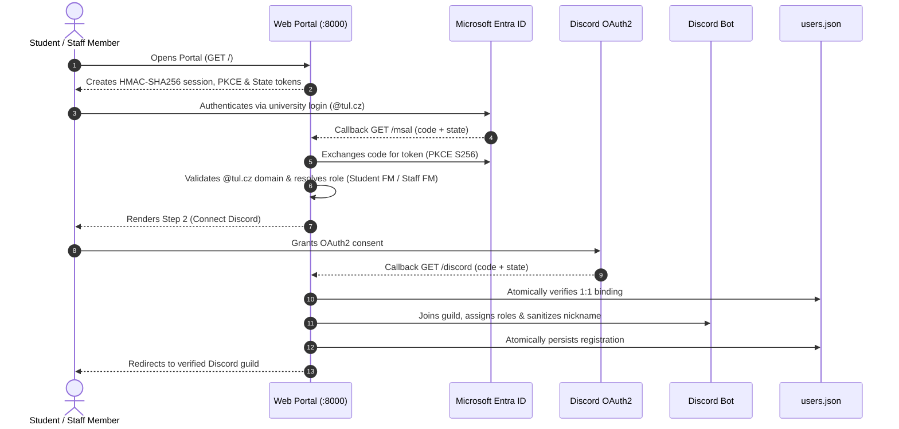

# FM TUL ↔ Discord Connector 🎓

[](https://go.dev/)
[](https://github.com/Mapetr/discord-pslib-connector)
[](https://github.com/Mapetr/discord-pslib-connector)
[](https://opensource.org/licenses/MIT)
[](https://github.com/Mapetr/discord-pslib-connector)
<!-- AUTO_METRICS_START -->
[](https://go.dev/)
[](https://go.dev/)
[](https://go.dev/)
[](https://discord.com/)
<!-- AUTO_METRICS_END -->

> **Enterprise-grade integration platform bridging university identities (Microsoft Entra ID) with community Discord servers.**  
> Built and optimized for the Faculty of Mechatronics, Informatics and Interdisciplinary Studies at the Technical University of Liberec (FM TUL).

---

## 📑 Table of Contents

1. [Overview](#-overview)
2. [Architecture & Data Flow](#-architecture--data-flow)
3. [Key Features](#-key-features)
4. [Security Architecture (Defense-in-Depth)](#-security-architecture-defense-in-depth)
5. [Installation & Quick Start](#-installation--quick-start)
6. [Configuration Reference](#-configuration-reference)
7. [Slash Commands Catalog](#-slash-commands-catalog)
8. [Production Deployment (systemd & Nginx)](#-production-deployment-systemd--nginx)
9. [Testing & Quality Assurance](#-testing--quality-assurance)
10. [AI Development & Knowledge Base](#-ai-development--knowledge-base)
11. [License](#-license)

---

## 💡 Overview

The FM TUL Discord Connector provides an automated, secure verification portal for university students and staff entering a community Discord guild.

### Core Value Propositions:
- **Official University Authentication:** Authenticates solely against the university's Microsoft Entra ID tenant (`@tul.cz` / `@fm.tul.cz`).
- **Zero External Database Overhead:** Operates with no SQL database (PostgreSQL, MySQL) or Redis cluster. Ships as a single Go binary storing state in local atomic JSON files with restricted permissions (`0600`).
- **Strict 1:1 Identity Mapping (Anti-Multi-Accounting):** Enforces a strict one-to-one relationship between a university Microsoft ID / Email and a Discord account.
- **Dynamic Configuration via Discord:** Roles, audit logs, welcome messages, and target channels can be modified live from Discord using the `/config` slash command without editing `.env` or restarting the service.

---

## 🏗️ Architecture & Data Flow



---

## 🌟 Key Features

- **Automated Role Provisioning:** Maps Microsoft Graph profile attributes into Discord roles (`Student FM`, `Zaměstnanec FM`, `Ověřený`).
- **Nickname Sanitization:** Sets the member's server nickname based on official university records while stripping control characters, zero-width spaces, and ping exploits (`@everyone`, `@here`, `<@`).
- **Real-Time Security Audit Log:** Streams rich embed notifications into a configured audit channel, tracking logins, blocked security violations (CSRF, rate limit triggers, multi-accounting attempts), and guild moderation events.
- **SSRF-Protected RSS Feed Module:** Automatically polls and publishes university news into dedicated channels with strict IP filtering.
- **Welcome Embeds:** Posts tailored onboarding messages welcoming new members with interactive verification buttons.
- **Local Dev Mock:** Offers simulated authentication flows for rapid frontend testing without cloud credentials (`ENABLE_DEV_MOCK=true`).

---

## 🛡️ Security Architecture (Defense-in-Depth)

Engineered from the ground up to meet stringent university cybersecurity requirements:

| Layer | Implementation | Threat Mitigated |
| :--- | :--- | :--- |
| **Session Integrity** | `HMAC-SHA256` signed cookies, `HttpOnly`, `SameSite=Lax`, `Secure`, `COOKIE_DOMAIN` | Session Hijacking, cookie tampering, XSS theft |
| **CSRF Defense** | 256-bit cryptographic state tokens consumed atomically in constant time | Callback CSRF, state injection, replay attacks |
| **Code Interception** | RFC 7636 PKCE (`S256` SHA-256 challenges) | Authorization code interception across untrusted networks |
| **DoS Mitigation** | `http.MaxBytesReader` 1 MB body limiter, strict HTTP timeouts | Memory exhaustion attacks, Slowloris |
| **Rate Limiting** | Sliding window 60 req/min per IP with `net.ParseIP` verification | Brute force, credential stuffing, API spam |
| **Origin Verification** | Normalizes and validates incoming `Origin` headers against `BASE_URL` | Cross-origin request forgery |
| **Storage Atomicity** | Two-phase atomic writes via temporary files with `0600` permissions | Database corruption on sudden shutdown, local tampering |
| **Multi-Accounting** | Mutex-synchronized validation of both Microsoft ID and Email address | Account sharing between students, TOCTOU races |
| **SSRF Defense** | `isValidRSSURL` filters loopback, private RFC 1918, and cloud metadata IPs | Internal network scanning via RSS feed inputs |
| **Open Redirect** | Strict domain validation for invite redirects (`https://discord.gg/`) | Malicious phishing redirects |

---

## 🚀 Installation & Quick Start

### Prerequisites
- [Go 1.21+](https://go.dev/dl/) or newer
- Discord Bot Token with privileged member intents enabled on the [Discord Developer Portal](https://discord.com/developers/applications)
- Microsoft Entra ID App Registration (refer to [LIANE_REQUEST.md](LIANE_REQUEST.md) for a ready-to-send template)

### 1. Clone Repository
```bash
git clone https://github.com/Mapetr/discord-pslib-connector.git sbibolet
cd sbibolet
```

### 2. Launch with Helper Scripts

**Linux / macOS:**
```bash
chmod +x ./scripts/start.sh
./scripts/start.sh
```

**Windows:**
```cmd
scripts\start.bat
```
*The setup script checks Go dependencies and initializes `.env` from template on first run.*

---

## ⚙️ Configuration Reference

The application uses a **hybrid configuration system**:
1. **Dynamic Configuration:** Saved in `discord_config.json` via `/config`. Overrides static defaults on the fly.
2. **Static Configuration:** Loaded from `.env` on service startup.

### Primary `.env` Parameters:

```env
# === Microsoft Entra ID (TUL) ===
MSAL_CLIENT_ID="your-azure-client-id"
MSAL_CLIENT_SECRET="your-azure-client-secret"
MSAL_TENANT_ID="common"

# === Discord Bot & OAuth2 ===
DISCORD_CLIENT_ID="your-discord-client-id"
DISCORD_CLIENT_SECRET="your-discord-client-secret"
DISCORD_TOKEN="your-discord-bot-token"
DISCORD_GUILD_ID="your-discord-guild-id"

# === Web Server & Cryptography ===
HOST="0.0.0.0"
PORT="8000"
BASE_URL="http://localhost:8000"
HMAC_SECRET="secure-random-secret-key-at-least-32-chars"
COOKIE_DOMAIN=""
SECURE_COOKIES="false"

# === RSS & Development ===
RSS_ENABLED="false"
ENABLE_DEV_MOCK="false"
```

> [!TIP]
> See [docs/knowledge-base/config-reference.md](docs/knowledge-base/config-reference.md) for full parameter specifications and dynamic JSON schemas.

---

## 🤖 Slash Commands Catalog

All administrative and user interactions are handled via native Discord Slash Commands:

<!-- AUTO_COMMANDS_START -->
| Command | Permission | Description |
| :--- | :--- | :--- |
| `/config set-channel` | Administrator | Configures the channel for selected feature (welcome or audit) |
| `/config set-message` | Administrator | Sets custom welcome message for newcomers (Markdown supported) |
| `/config set-role` | Administrator | Configures target role for selected group (verified, student, staff) |
| `/config view` | Administrator | Displays current configuration state (from JSON and .env) |
| `/delete` | Manage Messages | Safely deletes a message by its ID (managers only) |
| `/edit` | Manage Messages | Edits a bot's own message in a channel (managers only) |
| `/overit` | Everyone | Provides ephemeral verification link to the web portal |
| `/rss add` | Manage Messages | Adds a new RSS feed for monitoring (SSRF protected) |
| `/rss list` | Manage Messages | Lists all currently monitored RSS feeds |
| `/rss remove` | Manage Messages | Removes a tracked RSS feed by ID |
| `/say` | Manage Messages | Sends a message as the bot to a channel (managers only) |
| `/setup` | Administrator | Sends official verification embed with button and reaction (admin only) |
<!-- AUTO_COMMANDS_END -->

---

## 🌐 Production Deployment (systemd & Nginx)

### 1. Build Production Binary
```bash
go build -ldflags="-s -w" -o fm-tul-bot ./cmd/bot/
```

### 2. Configure systemd Service (`/etc/systemd/system/fm-tul-bot.service`)
```ini
[Unit]
Description=FM TUL Discord Connector
After=network.target

[Service]
Type=simple
User=botuser
WorkingDirectory=/opt/fm-tul-bot
ExecStart=/opt/fm-tul-bot/fm-tul-bot
Restart=always
RestartSec=5
LimitNOFILE=65535

[Install]
WantedBy=multi-user.target
```

### 3. Nginx Reverse Proxy Setup
```nginx
server {
    listen 443 ssl http2;
    server_name login.fm.tul.cz;

    ssl_certificate /etc/letsencrypt/live/login.fm.tul.cz/fullchain.pem;
    ssl_certificate_key /etc/letsencrypt/live/login.fm.tul.cz/privkey.pem;

    location / {
        proxy_pass http://127.0.0.1:8000;
        proxy_set_header Host $host;
        proxy_set_header X-Real-IP $remote_addr;
        proxy_set_header X-Forwarded-For $proxy_add_x_forwarded_for;
        proxy_set_header X-Forwarded-Proto https;
    }
}
```

---

## 🧪 Testing & Quality Assurance

The codebase includes comprehensive unit and integration tests with continuous race condition detection:

```bash
go test -v -race -count=1 ./...
```

### Validation Scope:
- **Cryptography & Sessions:** HMAC-SHA256 signatures, forgery detection, sliding expiration, domain cookies.
- **Security Middleware:** 1 MB payload DoS defense, trailing-slash origin normalization, client IP spoofing protection, CSP compliance.
- **Storage Concurrency:** High-concurrency TOCTOU race condition tests verifying 1:1 binding enforcement across 10 concurrent goroutines.
- **SSRF & Handlers:** Rejection of loopback and internal network URLs in RSS, nil pointer protection for DM interactions.

---

## 🧠 AI Development & Knowledge Base

This project provides comprehensive documentation designed to assist both human engineers and AI coding assistants (Antigravity, Cursor, Copilot, Claude):

- **[AGENTS.md](AGENTS.md):** Architectural invariants, thread-safety rules, command registration patterns, and strict guidelines for AI agents.
- **[docs/knowledge-base/](docs/knowledge-base/):** Detailed architectural blueprints:
  - [System Architecture](docs/knowledge-base/architecture.md)
  - [Security Deep-Dive](docs/knowledge-base/security.md)
  - [OAuth2 Flow Diagrams](docs/knowledge-base/oauth-flow.md)
  - [Slash Commands Reference](docs/knowledge-base/slash-commands.md)
  - [Configuration Matrix](docs/knowledge-base/config-reference.md)
  - [Auto-Generated Summary (SUMMARY.md)](docs/knowledge-base/SUMMARY.md)

### Automatic Knowledge Base Updates
When modifying routes, configuration options, or slash commands, run the updater script:
```bash
./scripts/update-knowledge-base.sh
```
The script analyzes the Go AST, regenerates `SUMMARY.md` and `AI_CONTEXT.md`, and runs test suites to ensure documentation fidelity.

---

## 📄 License

Licensed under the **MIT License**. See LICENSE file for details.

*Developed for the Faculty of Mechatronics, Informatics and Interdisciplinary Studies at TUL.*
