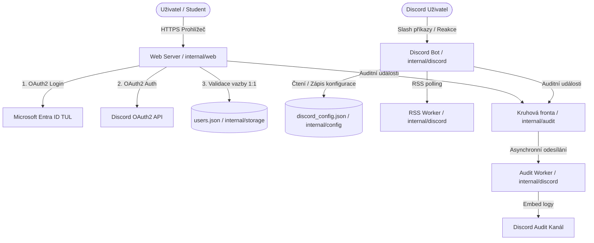

# Architektura systému FM TUL ↔ Discord Connector

Dokument popisuje vnitřní architekturu, modulární členění a toky dat aplikace `sbibolet` (FM TUL Discord Bridge).

---

## 1. Přehled architektury

Aplikace je navržena jako autonomní, soběstačná binárka bez nutnosti externích databázových systémů (PostgreSQL, Redis). Veškerá perzistence je řešena lokálními atomickými JSON soubory s právy `0600`.

---

## 2. Balíčky projektu (`internal/`)

| Balíček | Zodpovědnost |
| :--- | :--- |
| `cmd/bot` | Hlavní entrypoint, zachycení SIGINT/SIGTERM, graceful shutdown serveru a bota. |
| `internal/config` | Hybridní konfigurace: statický `.env` (`Cfg`) a za běhu měnitelný `discord_config.json` (`DynCfg`). |
| `internal/security` | HTTP Middleware (Origin, CSP, Rate limit, DoS limit), kryptografie (HMAC, PKCE, State tokeny), sanitizace. |
| `internal/session` | In-memory session store s klouzavou expirací (15 min) a HMAC-SHA256 podepsanou cookie. Thread-safe metody. |
| `internal/storage` | Atomické ukládání uživatelů do `users.json`, striktní pravidlo 1:1 (Anti-Multi-Accounting). |
| `internal/discord` | Správa Discord bota: registrace slash příkazů, obsluha interakcí, reakcí, RSS worker, Audit worker. |
| `internal/web` | HTTP router (`ServeMux`), OAuth2 handlery (`/msal`, `/discord`), vývojové mocky, HTML šablona. |
| `internal/audit` | Centrální asynchronní fronta auditních událostí s neblokujícím odesíláním (`select-default`). |

---

## 3. Toky dat a zpracování

### 3.1 Dvoufázová autentizace (TUL -> Discord)
1. **Index (`/`):** Vytvoření podepsané session (`tul_session`), generování CSRF tokenu `msState` a PKCE verifieru/challenge.
2. **Microsoft Callback (`/msal`):**
   - Atomické ověření a spotřebování `msState` (`session.ConsumeMSALState`).
   - Výměna kódu za Microsoft Access Token pomocí PKCE `code_verifier`.
   - Načtení profilu z Microsoft Graph API (`/v1.0/me`).
   - Striktní validace e-mailu na doménu `@tul.cz`.
   - Uložení údajů do `session.Student` a přesměrování zpět na `/`.
3. **Discord Callback (`/discord`):**
   - Atomické ověření a spotřebování `discordState` (`session.ConsumeDiscordState`).
   - Výměna kódu za Discord Access Token (`identify`, `guilds.join`).
   - Načtení profilu z Discord API (`/users/@me`).
   - Kontrola vazby 1:1 (`storage.CheckBindingAllowed`).
   - Přidání uživatele na server (`guilds.join`) nebo přiřazení rolí a sanitované přezdívky.
   - Atomické uložení do `users.json`.
   - Odeslání auditního záznamu a přesměrování na server přes validovanou Discord invite URL.

---

## 4. Dlouhoběžící na pozadí (Workers)

1. **Audit Worker (`internal/discord/audit_worker.go`):**
   - Naslouchá na read-only kanálu `audit.GetChannel()`.
   - Dynamicky vyhodnocuje cílový auditní kanál z konfigurace.
   - Pokud kanál není nastaven, loguje do systémového výstupu (stdout), aby nedošlo k ucpání fronty.
2. **RSS Worker (`internal/discord/cmd_rss.go`):**
   - Periodický ticker (výchozí 30 minut) stahuje registrované RSS zdroje.
   - Thread-safe snapshot feedů bez blokování mutexu během HTTP požadavků.
   - Ochrana proti SSRF (`isValidRSSURL`).
3. **Session Cleaner (`internal/session/session.go`):**
   - Periodický ticker (každé 2 minuty) odstraňuje expirované HTTP sessions a staré záznamy rate limiteru.
