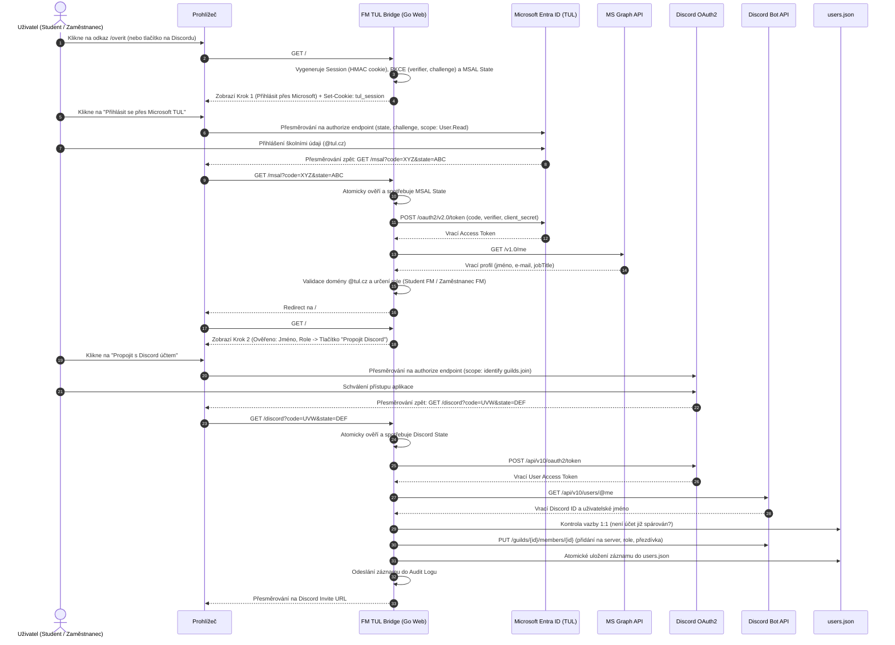

# Průběh OAuth2 Autentizace a Propojení Účtů

Tento dokument detailně popisuje kompletní tok dvoufázové autentizace (Microsoft Entra ID + Discord OAuth2) s interakcí koncového uživatele a API rozhraní.

---

## 1. Sekvenční diagram toku

---

## 2. API Parametry a Scopes

### 2.1 Microsoft Graph
- **Scoping:** `User.Read openid profile email`
- **Koncový bod:** `https://graph.microsoft.com/v1.0/me?$select=id,displayName,mail,userPrincipalName,jobTitle,department`
- **Validace identity:**
  - E-mail je převzat z `mail`, případně záložně z `userPrincipalName`.
  - Prochází validací `IsValidTULEmail`, která striktně vyžaduje suffix `@tul.cz` nebo `.tul.cz`.
  - `DetermineRole` prověří přítomnost `jobTitle` nebo klíčového slova `zamestnanec` v e-mailu.

### 2.2 Discord OAuth2
- **Scoping:** `identify guilds.join`
- **Koncové body:**
  - Token exchange: `https://discord.com/api/v10/oauth2/token`
  - Profil uživatele: `https://discord.com/api/v10/users/@me`
  - Přidání člena na server / správa rolí: `https://discord.com/api/v10/guilds/{guild.id}/members/{user.id}`
